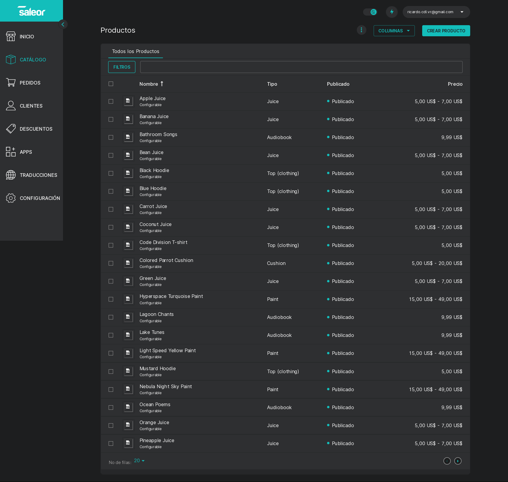
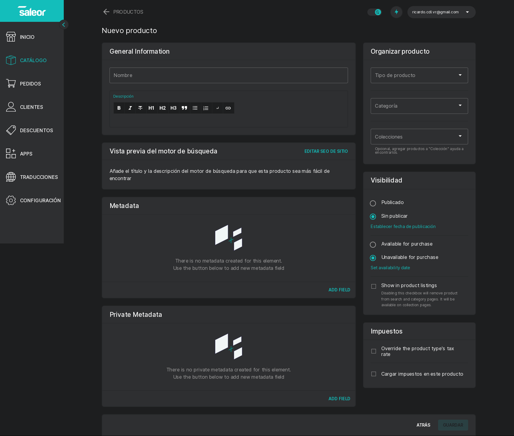
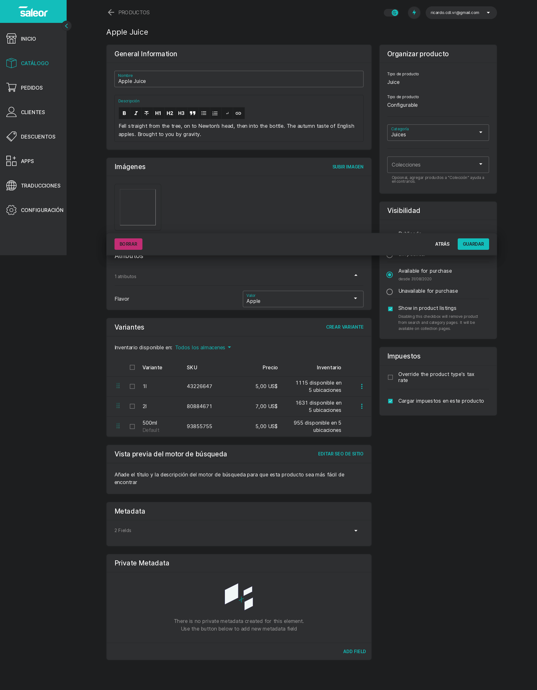
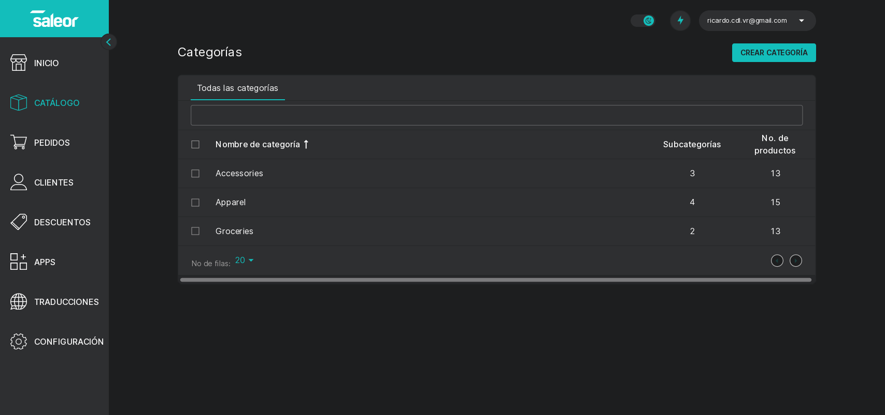
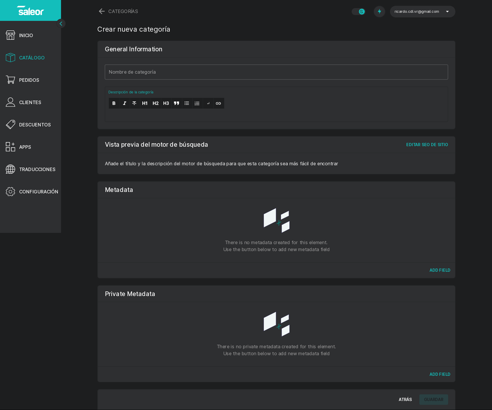

# Catálogo

## Productos

Al acceder a este menú se muestra una lista de todos los productos registrados en la base de datos de la plataforma.

La lista de productos puede ser filtrada por Categorías, Colecciones, Precio, Tipos de Producto, Visibilidad y Cantidad de stock, pulsando el botón **Filtros**, e introduciendo los valores correspondientes en cada filtro deseado.

De la misma manera, pulsando el botón **Columnas ▾** puede seleccionar que columnas se mostrán en la lista, seleccionado las que desea mostrar y luego pulsando en el botón **Guardar**, puede volver a la vista por defecto pulsando el botón **Reiniciar** o deshacer los cambios sin guardar pulsando el botón **Cancelar**.

### Crear Producto

Para crear un nuevo producto, pulse el botón **Crear Producto** en la parte superior izquierda de la pantalla **Productos**.

En la pantalla de creación de productos, podrá ingresar la información necesaria para registrar un nuevo producto en la base de datos, estas son:

* Nombre del Producto
* Descripción breve del producto (soporta formato avanzado, sintaxis Markdown/HTML)
* Tipo de Producto
* Categoría del Producto
* Colecciones
* Visibilidad en el módulo de Tienda
* Impuestos
* Metadatos
* Datos para SEO y el motor de búsqueda del módulo de Tienda

Una vez el producto ha sido guardado con estos datos iniciales, en la pantalla de **Editar Producto** pueden agregarse datos adicionales.

### Editar Producto

Para editar un producto existente solo debe pulsar el nombre del producto en la lista del menú Productos o bien acceder al mismo desde el navegador (<kbd>Ctrl</kdb> + <kbd>K</kdb>)

Esta pantalla es muy similar a la mostrada anteriormente para **Crear Producto**, la principal diferencia es que aparece el [**menú de administración de imágenes del producto**](img_admin.md) y el [**menú de administración de variantes**](variants.md) y el submenú de **atributos**.

Cada uno de estos submenús se explora en su propia página dedicada.

### Exportar Lista de Productos

Para exportar la lista de productos, haga clic/pulse el ícono con tres (3) puntos verticales del lado izquierdo del botón <kbd>**Columnas ▾**</kbd> y luego en **Exportar productos**.

En la pantalla emergente, seleccione los campos de la lista de productos que desea exportar (Organización de productos, atributos, información financiera, entre otros), pulse el botón **Siguiente**, seleccione el rango a exportar (búsqueda actual, productos seleccionados, todos) y el formato deseado (Hoja de cálculo para Excel, Numbers, etc ó CSV plano), espere unos momentos y guarde el archivo que se presenta como descarga (el manejo específico de este paso dependerá por completo de su Sistema Operativo y/o su Navegador y las configuraciones del mismo, en caso de un problema, consulte con su departamento de T.I.).

## Categorías

En esta menú se encuentra una lista de las categorías registradas en el sistema, presentadas en una tabla donde pueden ordenarse por nombre, subcategorías y número de productos.

En la parte inferior del lado izquierdo puede encontrarse una lista desplegable con varias opciones para mostrar cierto número de filas a la vez. Del lado derecho se encuentras dos botones <kbd><</kbd> y <kbd>></kbd> que permitirán desplazarse por la tabla a las páginas anteriores y siguientes respectivamente.

### Crear Categoría

### Editar Categoría

## Colecciones
### Crear Colección
### Editar Colección

## Tarjetas de Regalo
### Crear Tarjetas de regalo
### Editar Tarjeta de regalo
