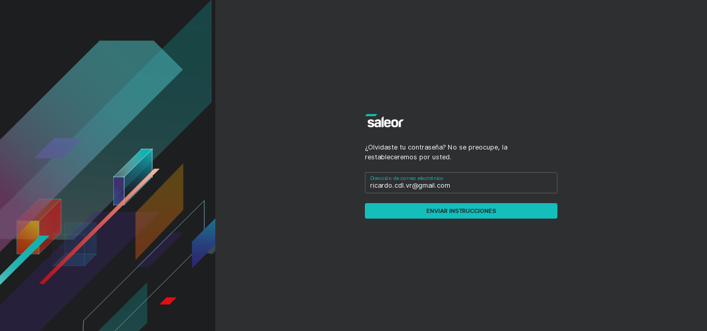
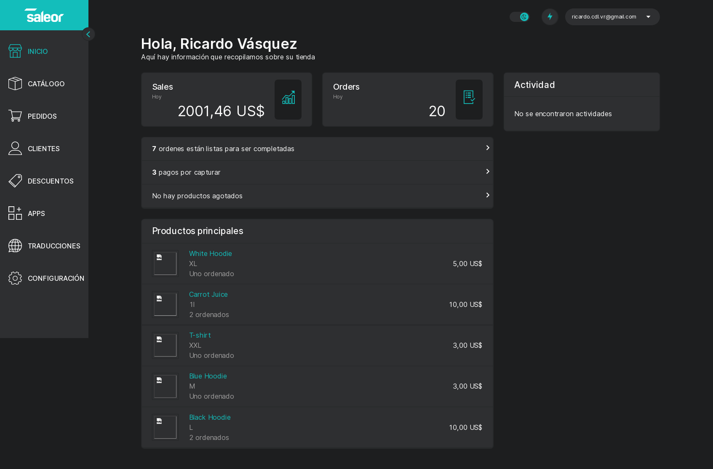

# Tablero de Control

El **Tablero de Control** es el módulo de la plataforma que le permitirá crear y editar valores en la base de datos a través de una interfaz simple e intuitiva. Si bien es posible editar dichos valores mediante otros métodos, no es recomendable.

Mediante esta interfaz, se podrán realizar operaciones tales como: agregar/editar productos, ofertas, almacenes, categorías de productos, administrar clientes, inventario en almacenes, entre otras.

!!! warning "**Este módulo esta restringuido a los miembros autorizados de su empresa/organización. Mediante un correo electrónico y una contraseña, que solo podrán asignarse por un Administrador del correspondiente departamento.**"

### Página de Inicio de sesión

Para Iniciar sesión en el Tablero de control, ingrese la dirección de correo electrónico registrada en el sistema, seguido de su contraseña, en el campo marcado para tal fin.

### Recuperación de contraseña

Para recuperar su contraseña, ingrese la dirección de correo electrónico asociada a su cuenta de usuario y siga las instrucciones del mensaje que recibirá en su bandeja de entrada.

!!! danger "Si el mensaje de recuperación de contraseña no aparece en su bandeja de entrada, revise cuidadosamente la sección de Spam de su cliente de correo, así como cualquier filtro que pueda bloquear el correo del sistema."

### Pantalla Principal

Esta es la ventana inicial del Tablero de de Control, en columna a la izquierda se puede observar el menú principal, donde se encuentran los submenús de [Catálogo](catalogue.md), [Pedidos](orders.md), [Clientes](clients.md), [Descuentos](discounts.md), [Apps](apps.md), [Traducciones](translations.md) y [Configuraciones](dashboard-settings.md). 

!!! tip "Pulse o haga clic en el interruptor de tema (:material-weather-sunny: / :material-weather-night:), para activar y desactivar el "Modo Oscuro"."

Puede acceder a estos menús haciendo clic sobre su nombre o pulsando sobre el ícono con 3 líneas, y luego en el menú que desee acceder (en el caso de acceder mediante la versión móvil). 

!!! warning "**ESTE ELEMENTO ES EXCLUSIVO DE LA VERSIÓN DE ESCRITORIO**"
    Si puede apreciar un boton con el símbolo <kbd><</kbd> o <kbd>></kbd>, este que permitirá cambiar esta columna entre el modo "Íconos y texto" y "Sólo Icono", lo cual le permite ganar valioso espacio de pantalla para otras interfaces de ser necesario; Este botón esta disponible en todas las pantallas del **Tablero de Control**.

En la columna central, se encuentra un pequeño resumen de actividad, donde se muestran representadas el volumen de ventas de la fecha actual, así como las órdenes y su estado, además de un recordatorio en caso de que algún producto presente existencias bajas o se encuentre agotado. Adionalmente al final de esta columna se muestra una lista dinámica que muestra los productos mas vendidos, algunos detalles sobre los mismos y su precio.

En la columna derecha se encuentra un módulo de recordatorio de actividades tales como ofertas activas.

!!! warning "**ESTE ELEMENTO ES EXCLUSIVO DE LA VERSIÓN DE ESCRITORIO**"

    **El navegador** se encuentra entre el interruptor para el **Modo Oscuro** y el **Panel de Usuario**, es representado con un ícono de un rayo (:material-flash:), le permite acceder rápidamente a otros menús y pantallas del Tablero de Control, escribiendo el nombre completo o parcial del mismo.También puede acceder a él desde cualquier pantalla o menú del Tablero de Control pulsando el atajo de teclado <kbd>Ctrl</kbd> + <kbd>K</kbd>.

El **Panel de Usuario**, es un menú desplegable que muestra el correo electrónico del usuario activo, al desplegarse, muestra un enlace a la configuración de cuenta (donde el usario activo podrá editar su avatar, nombre, apellido, correo electrónico asociado a la cuenta, contraseña e idioma preferido) y además permite cerrar la sesión activa, volviendo a la pantalla de inicio sesión.